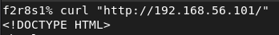
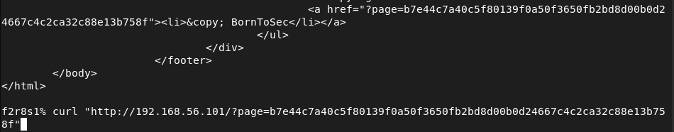
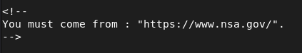
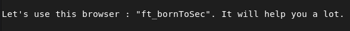
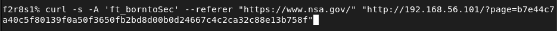
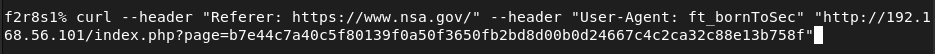
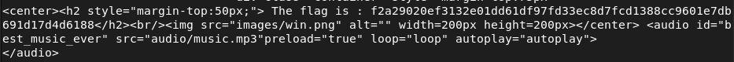

## **Open Redirection (BornToSec)**

### **Description**
Dans le pied de page, un lien nommé "bornToSec" pointe vers une page contenant une musique. Dans les commentaires du code source, des indications suggèrent de modifier les en-têtes HTTP (Referer et User-Agent) pour simuler une provenance depuis le site https://www.nsa.gov/ et un navigateur personnalisé nommé "ft_bornToSec".

---

Referer : contient l'adresse de la page web précédente à partir de laquelle un lien a été suivi pour demander la page courante, il permet aux serveurs d'identifier la provenance des visiteurs d'une page.

User-Agent : chaîne de caractères envoyée par un client, comme un navigateur web, dans l'en-tête pour identifier le logiciel client auprès du serveur web, cette information permet au serveur de reconnaître le type de navigateur, la version du système d'exploitation, le type d'appareil (ordinateur, mobile, etc.)

### **Exemples d’exploitation**
Contournement de protections basiques : Cette méthode pourrait être utilisée comme "protection" supplémentaire pour un web service, mais elle est facilement contournable.
Automatisation via script : Un script shell est possible pour envoyer une requête avec les en-têtes modifiés.
Le principe de bse se repose sur ce fonctionnement : une application web accepte une URL en paramètre (ex: ?redirect=https://exemple.com) et redirige l’utilisateur vers cette URL sans validation, un attaquant peut ainsi créer un lien comme https://site-legitime.com/redir?url=https://site-malveillant.com.

Risques liés au Referer : si un utilisateur clique sur un lien malveillant via une open redirect, le site malveillant reçoit le Referer contenant l’URL du site légitime, cela peut être utilisé pour du phishing (le site malveillant peut imiter le site légitime (ex: banque) et voler des identifiants), du vol de session (si le lien contient des jetons d’authentification dans l’URL, ils peuvent être exposés) ou du contournement de protections (certains sites bloquent l’accès direct depuis des sites malveillants, mais acceptent les redirections depuis des sites de confiance)

Risques liés au User-Agent : le User-Agent identifie le navigateur et le système d’exploitation de l’utilisateur et donc un attaquant peut exploiter cette information pour cibler des attaques (adapter le contenu malveillant en fonction du navigateur ou de l’OS, ex: exploiter une faille spécifique à une version de Chrome) ou faire du fingerprinting (identifier et suivre un utilisateur à travers plusieurs sites, même sans cookies).

Combiner les deux peut alors avec le site malveillant afficher une fausse page de login pour voler des identifiants, exploiter une faille spécifique au navigateur de la victime ou rediriger vers un téléchargement de malware.

### **Recommandations**
Remplacer cette "protection" par une authentification robuste (page de connexion admin, gestion de session sécurisée).
Si cette méthode est utilisée pour un web service, ajouter un token ou un passcode supplémentaire dans les paramètres, et ne jamais se fier uniquement aux en-têtes HTTP.
