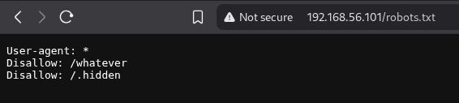
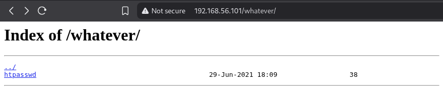
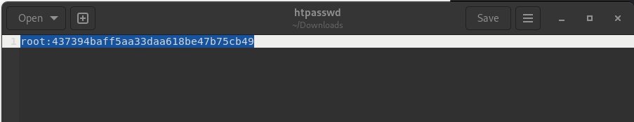
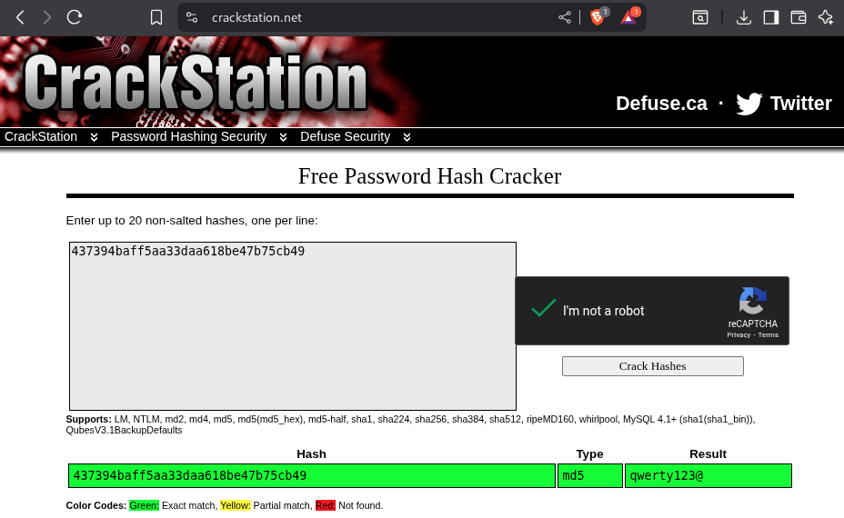
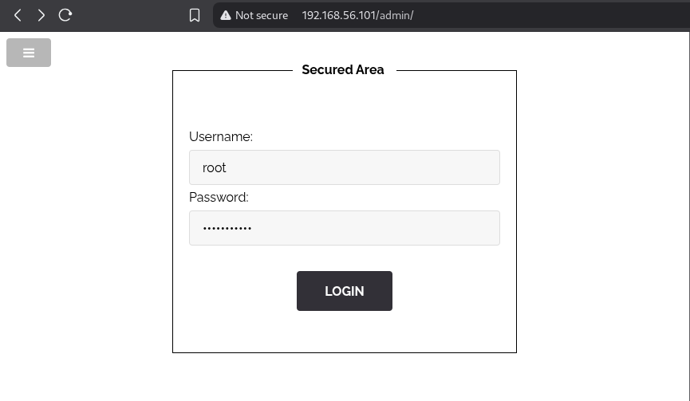

## **Sensitive Information Disclosure (robots.txt / .htpasswd)**

### **Description**

Le fichier `robots.txt` du site contient une directive `Disallow: /whatever`, indiquant aux robots d’indexation de ne pas explorer ce dossier. **Cependant, ce dossier est accessible publiquement.**

En y accédant, on découvre un fichier `.htpasswd` contenant un couple login/mot de passe. Le mot de passe est haché en MD5, ce qui permet de le casser facilement via une base de données de hashs.

**Exemple d’exploitation** 

En réutilisant ces identifiants sur la route `/admin`, on obtient un accès non autorisé au flag.

- **Récupération d’identifiants sensibles** : Un attaquant peut scanner les dossiers "cachés" par `robots.txt` et récupérer des informations critiques si elles ne sont pas correctement protégées.
- **Accès non autorisé** : Les identifiants trouvés peuvent être réutilisés pour accéder à des zones administratives ou sensibles du site.

### **Recommandations**
- **Ne jamais se fier à `robots.txt` pour protéger des informations sensibles** : ce fichier est une convention, non une protection.
- **Protéger les dossiers sensibles** avec un fichier `.htaccess` (ou équivalent selon le serveur web) pour restreindre l’accès.
- **Utiliser des algorithmes de hachage modernes et sécurisés** (bcrypt, Argon2) à la place de MD5, qui est obsolète et vulnérable aux attaques par table arc-en-ciel.