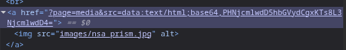
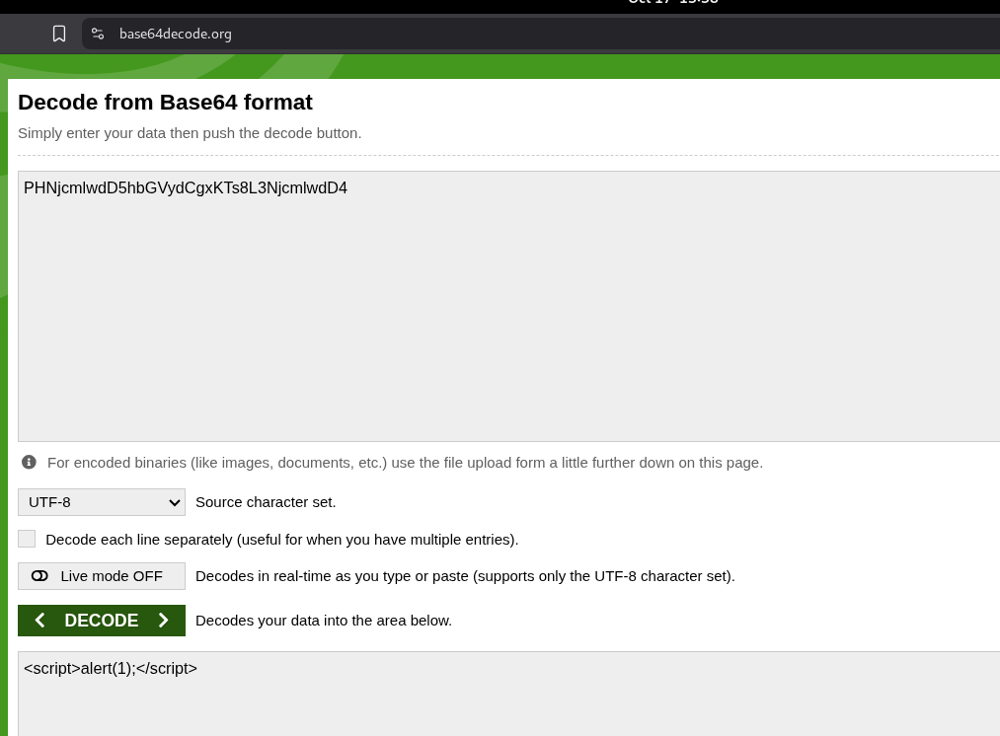

## **XSS via Media Image (Injection de code malveillant)**

### **Description**
Sur la page d’accueil, une image (par exemple, une photo de la NSA) est chargée via un "viewer" d’image utilisant l’URL suivante : `?page=media&src=`.
**Problème :** Le paramètre `src` est inséré directement dans le code HTML, sans validation ni échappement, ce qui permet une **injection XSS (Cross-Site Scripting)**.
Un attaquant peut passer une donnée (notamment un script) encodée en base64 ou une URL malveillante, par exemple :
`?page=media&src=data:text/html;base64,PHNjcmlwdD5hbGVydCgxKTs8L3NjcmlwdD4=`



Ce code exécute un script JavaScript arbitraire dans le contexte du site.



### **Exemples d’exploitation**
- **Vol de cookies/sessions** : Un attaquant peut récupérer les cookies de l’utilisateur, qui contiennent parfois des identifiants ou mots de passe en clair.
- **Redirection vers un site malveillant** : Possibilité de rediriger l’utilisateur vers un site de phishing ou d’exécuter du code arbitraire.
- **Attaques ciblées** : Exploitation pour compromettre des comptes utilisateurs ou administrateurs.

### **Recommandations**
- **Ne jamais insérer directement des paramètres d’URL dans le code HTML** sans validation ni échappement.
- **Utiliser des identifiants (IDs) pointant vers des ressources sécurisées** (exemple : images stockées en base de données ou dans un dossier protégé).
- **Appliquer un échappement strict** des données dynamiques (utiliser des fonctions comme `htmlspecialchars()` en PHP).
- **Mettre en place une politique de sécurité CSP (Content Security Policy)** pour limiter l’exécution de scripts non autorisés.

### **Exemple de code corrigé (PHP)**
```php
// Liste blanche des images autorisées
\$allowed_images = [
    'nsa.jpg' => '/images/nsa.jpg',
    'logo.png' => '/images/logo.png'
];

\$src = \$_GET['src'] ?? '';
if (isset(\$allowed_images[\$src])) {
    \$image_path = \$allowed_images[\$src];
    echo '';
} else {
    die("Image non autorisée.");
}
