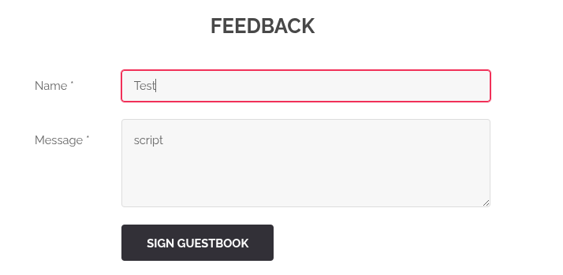

## **XSS via Formulaire de Feedback**

### **Description**
Sur la page de feedback, l’insertion du mot `"script"` dans le champ de commentaire déclenche l’affichage d’un flag, révélant une **faille XSS (Cross-Site Scripting)**.



**Problème :** Le site n’échappe pas les entrées utilisateur avant de les afficher, permettant l’injection de code JavaScript. Même si l’exemple donné (`"script"`) est simpliste, il est possible d’injecter des balises `<script>` complètes pour exécuter du code malveillant.

### **Exemples d’exploitation**
- **Vol de cookies/sessions** : Un attaquant peut rediriger les utilisateurs vers une page malveillante ou récupérer leurs cookies (qui contiennent parfois des données sensibles en clair).
- **Attaques de phishing** : Injection de faux formulaires ou de messages trompeurs pour récupérer des identifiants.
- **Défiguration de page** : Modification de l’affichage pour nuire à l’image du site.

### **Recommandations**
- **Toujours échapper les entrées utilisateur** avant affichage (utiliser `htmlspecialchars`, `strip_tags`, ou des bibliothèques dédiées).
- **Valider et filtrer les données** côté serveur avant tout traitement ou stockage.
- **Utiliser des en-têtes de sécurité** (CSP) pour limiter l’exécution de scripts non autorisés.
- **Ne jamais faire confiance aux données envoyées par le client** sans validation stricte.

### **Exemple de code corrigé (PHP)**
```php
\$comment = \$_POST['comment'] ?? '';
\$cleaned_comment = htmlspecialchars(\$comment, ENT_QUOTES, 'UTF-8');
// Affichage sécurisé :
echo "<p>" . \$cleaned_comment . "</p>";
