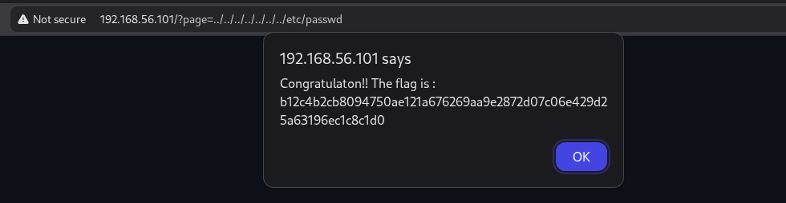

## **Local File Inclusion (LFI) / Directory Traversal**

### **Description**
Le site utilise un paramètre `page` pour inclure dynamiquement des fichiers via une URL du type `?page=nom_de_la_page`.
**Problème :** Il est possible de manipuler ce paramètre pour remonter dans l’arborescence du serveur en utilisant des séquences comme `../../../../../../../etc/passwd`.
Cela permet d’accéder à des fichiers sensibles du système, comme `/etc/passwd`, ou à des fichiers de configuration contenant des mots de passe.



### **Exemples d’exploitation**
- **Accès à des fichiers sensibles** : Récupération de fichiers de configuration (mots de passe de base de données, clés privées, etc.).
- **Exécution de code arbitraire** : Si combiné avec une faille d’inclusion de fichiers distants (RFI), un attaquant pourrait exécuter du code malveillant.
- **Vol de données** : Accès à des logs, sauvegardes ou autres fichiers internes.

### **Recommandations**
- **Ne jamais inclure directement un paramètre utilisateur** dans une fonction d’inclusion de fichier.
- **Limiter les inclusions à une liste blanche** de fichiers autorisés, situés dans un dossier dédié.
- **Valider et nettoyer strictement** les entrées utilisateur avant toute utilisation.
- **Désactiver l’inclusion de fichiers distants** si non nécessaire.

### **Exemple de code corrigé (PHP)**
```php
function get_authorized_pages(\$folder)
{
    \$files = array_slice(scandir(ROOT . '/' . \$folder), 2);
    return array_map(
        function(\$str) {
            return str_replace('.php', '', \$str);
        },
        \$files
    );
}

\$authorized_pages = get_authorized_pages('pages');
if (isset(\$_GET['page']) && in_array(\$_GET['page'], \$authorized_pages)) {
    include_once('pages/' . \$_GET['page'] . '.php');
} else {
    die("Page non autorisée.");
}
